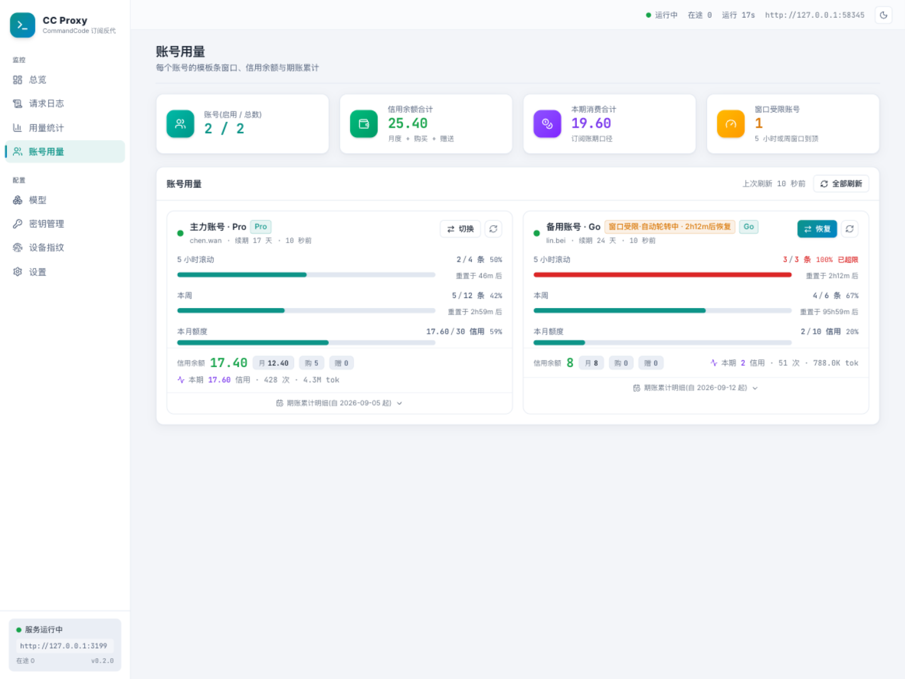
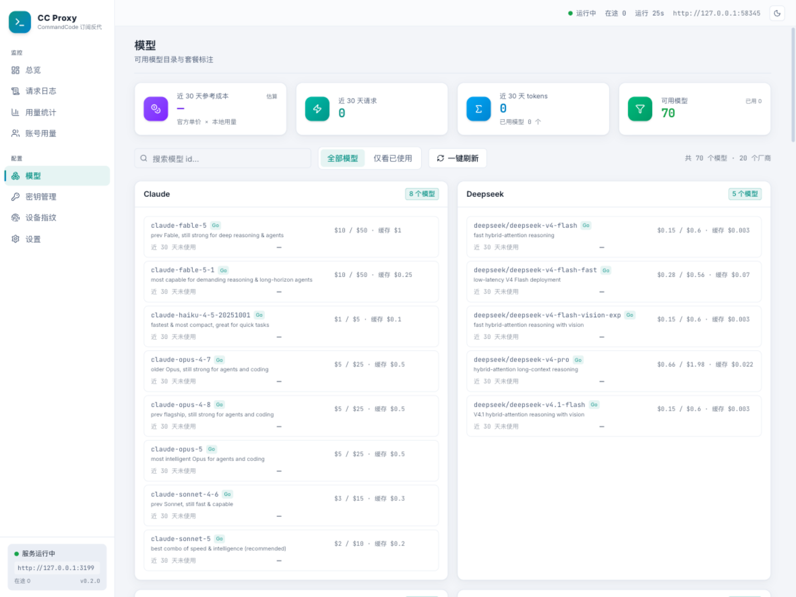

# CommandCodeGo-manager

[](https://linux.do)

Command Code 订阅反向代理:把 [Command Code](https://commandcode.ai)(含 $1/月的 Go 套餐)的订阅额度反代为
**OpenAI 兼容**(`/v1/chat/completions`、`/v1/responses`)与 **Anthropic 兼容**(`/v1/messages`)端点,
供任意 harness(Claude Code / OpenCode / ZCode / cURL / 任意 OpenAI·Anthropic SDK)使用;
自带美观的中文 Web 管理界面(仪表盘、实时日志、用量统计、账号用量、模型价目、密钥管理、设备指纹、设置)。
**提供 macOS / Windows 桌面版**(双击即用的原生应用,服务后台常驻 + 托盘)。

协议层派生自 [MAXeaglet/commandcode-proxy](https://github.com/MAXeaglet/commandcode-proxy)(MIT,基线
`9bdfafc`),wire 行为与其逐项对齐,并保持其测试套件全绿。详见 [NOTICE](./NOTICE)。

> ⚠️ **免责声明**:本项目为非官方逆向工程产物,与 Command Code / Langbase 无关联。使用逆向协议可能违反
> Command Code 服务条款,账号风险由使用者自行承担,仅供学习与研究用途。


## 目录

- [特性](#特性)
- [管理界面一览](#管理界面一览)
- [账号用量面板](#账号用量面板)
- [模型价目与花销](#模型价目与花销)
- [设备指纹(可视化查验)](#设备指纹可视化查验)
- [快速开始](#快速开始)
  - [方式〇:桌面版(macOS / Windows,推荐)](#方式〇桌面版macos--windows推荐)
  - [方式一:裸 Node(要求 Node ≥ 22.5)](#方式一裸-node要求-node--225)
  - [方式二:单文件 bundle](#方式二单文件-bundle)
  - [方式三:Docker(服务器部署)](#方式三docker服务器部署)
  - [开发模式](#开发模式)
- [接入 harness](#接入-harness)
  - [cURL](#curl)
  - [OpenAI SDK / 任意 OpenAI 兼容客户端](#openai-sdk--任意-openai-兼容客户端)
  - [Claude Code(Anthropic 协议)](#claude-codeanthropic-协议)
  - [ZCode / OpenCode 等](#zcode--opencode-等)
- [配置](#配置)
  - [运行时旋钮(仅环境变量)](#运行时旋钮仅环境变量)
- [安全须知](#安全须知)
- [内存与部署(公网必读)](#内存与部署公网必读)
- [许可](#许可)

## 特性

- OpenAI Chat Completions + Responses + Anthropic Messages 三端点,流式(SSE)与非流式
- 工具调用、多模态图片输入、`reasoning_effort`、缓存命中计量、thinking 签名伪装
- 每个 key 确定性设备指纹(同 key 恒定同设备),对齐官方 CLI 1.53.1 的流量形态;管理界面「设备指纹」页可视化查验伪造形态与上报结果
- 零输出 / 连续超时响应转 429,让下游 SDK 自动重试;客户端断连时真实中止上游
- 客户端密钥体系:`sk-ccp-*` 密钥(哈希存储、显式绑定上游 key、可吊销);也支持 `user_*` 直通
- Web 管理界面(免登录,仅回环可用):实时请求日志(SSE)、用量聚合、密钥管理、协议漂移告警;「账号用量」面板矩阵展示每个账号的模板条(5 小时滚动 / 周 / 月度)、信用余额与期账累计,支持单账号或全部刷新、手动切换账户,数据每 5 分钟自动刷新
- 额度/窗口耗尽自动轮转:402 信用耗尽持久标记换 key;5 小时滚动 / 周窗口到顶(429 `USAGE_EXCEEDED`)运行时标记到重置时刻,窗口恢复自动回切;绑定与直通(user_* 已入库)密钥均参与,瞬态 429 不轮转
- SQLite 持久化(内置 `node:sqlite`,零原生依赖):请求日志 30 天可配,用量按天×key×模型聚合
- 零运行时依赖(Node ≥ 22.5);桌面应用与 esbuild 单文件分发

## 管理界面一览

| 请求日志(实时 SSE 推送,按端点 / 状态 / 密钥过滤,分页) | 用量统计(按天 / 模型 / 密钥) |
|:---:|:---:|
|  |  |

| 账号用量(模板条 / 信用余额 / 期账累计) | 模型列表(官方价目 × 本地用量的参考成本) |
|:---:|:---:|
|  |  |

| 密钥管理(上游账户 + 客户端密钥) | 设置(端口、协议开关、日志留存) |
|:---:|:---:|
|  |  |

## 账号用量面板

每个上游账号一张卡片,把订阅的「能用到哪」摊开给你看:


*账号用量:三条模板条 + 信用余额三池 + 期账累计;到限转红并显示重置倒计时*

- **模板条**:5 小时滚动 / 周 / 月度三个额度窗口各一条,已用 / 上限 / 占比与重置倒计时,
  到顶转红标记「已超限」——月度条按套餐总额(Go=10、Pro=30、Max=150……)折算;
- **信用余额**:月度 / 购买 / 赠送三池余额与合计,低于阈值转黄;
- **期账累计**:订阅账期内的总请求、成败、成功率、总消费(信用)、平均消费与 token 明细,点卡片展开;
- **刷新**:单账号或全部手动刷新,服务端每 5 分钟自动刷新(可配),数据不过夜;
- **切换账户**:一键把某账号标记切走(新请求自动路由到其他账号),窗口重置或手动恢复前不再使用它;
- **到限自动轮转**:5 小时滚动 / 周窗口到顶时代理自动换账号重试,窗口恢复自动切回
  (详见下文「额度耗尽自动轮转」)。

## 模型价目与花销

模型页把官方公开价目($/1M 输入 / 输出 / 缓存读,71 个模型)与本代理近 30 天的
真实用量合在一起:每个模型的单价、上下文、最低套餐一目了然,用过的模型直接算出
**参考成本**并按成本排序,顶部汇总近 30 天总成本 / 请求数 / tokens——
哪个模型便宜好用,选型不再靠猜(参考成本 = 单价 × 本地 token 计量,订阅内实际按信用扣减)。

## 设备指纹(可视化查验)

代理不会把宿主机的真实信息(平台、Node 版本、工作目录)透给上游,而是为**每个上游密钥确定性伪造一台
Windows 设备身份**——CPU / 内存 / 时区 / MAC / MachineGuid / 主机名 / git 邮箱,哈希算法与官方 CLI
逐字对齐(同盐 `command-code:device-fingerprint:v1`)。同一密钥无论重启、多实例、停用数周后恢复,
上游看到的始终是同一台设备;「换设备」本身就是可疑信号,所以指纹由 key 派生而非随机。

管理界面「设备指纹」页把这一切摊开给你看:统一设备档案、每个 key 伪造出的具体形态、thumbmark
与各信号哈希、指纹 / 生命周期事件的上报时间与结果、下次刷新时间——是不是真做了,打开页面即可验证。


指纹状态为运行时数据,进程重启后按需重建;页面仅显示启动后使用过的密钥,key 只展示前 8 位前缀。
如需成批更换全部伪造身份(不换真实 key),配置环境变量 `CC_FINGERPRINT_SALT` 即可。

## 快速开始

### 方式〇:桌面版(macOS / Windows,推荐)

从 `release/` 目录(或 GitHub Releases / Actions 产物)取安装包:

| 平台 | 文件 | 说明 |
|---|---|---|
| macOS Apple Silicon | `CommandCodeGo Manager-<v>-arm64.dmg` | M 系列芯片 |
| macOS Intel | `CommandCodeGo Manager-<v>.dmg` | — |
| Windows x64 | `CommandCodeGo Manager-Setup-<v>-x64.exe` | 安装版(NSIS) |
| Windows x64 | `CommandCodeGo Manager-Portable-<v>-x64.exe` | 免安装便携版 |
| Windows 通用 | `CommandCodeGo Manager-Setup-<v>.exe` | 双架构合并安装器 |

- 管理界面免登录(H1:API 仅监听回环地址,浏览器跨站写由 Origin 校验拦截)。
- 关闭窗口后服务在**后台继续运行**(托盘图标常驻,默认 `http://127.0.0.1:3050`);
  从托盘菜单「退出」才真正结束。端口被占用时自动向后尝试。
- 桌面版未做代码签名:macOS 从网络下载的安装包**首次打开会被 Gatekeeper 误报「已损坏」**
  (未签名应用 + 浏览器下载的隔离标记所致,文件本身完好;右键→打开对此无效)。
  应用拖入「应用程序」后在终端执行一次:
  ```bash
  xattr -cr "/Applications/CommandCodeGo Manager.app"
  ```
  再正常打开即可。Windows SmartScreen 可能提示「仍要运行」。

本地自行构建桌面版:

```bash
npm --prefix web install && npm run build:web   # 1) Web UI → public/
npm install && npm run bundle                    # 2) 服务端 → dist/commandcodego-manager.mjs
cd desktop && npm install
npm run dist:mac   # macOS dmg(zip 同步产出,arm64 + x64)
npm run dist:win   # Windows nsis + portable(x64 + arm64;CI 上原生构建更稳)
npm run smoke      # 无窗口冒烟:拉起服务并探活(开发验证用)
```

### 方式一:裸 Node(要求 Node ≥ 22.5)

```bash
node server.mjs            # 首启会在 data/config.json 落默认配置,并在控制台打印管理界面 token
# 打开 http://127.0.0.1:3050/ 进入管理界面
```

Web 界面需要构建一次(之后 `public/` 会被服务进程托管):

```bash
cd web && npm install && cd ..
npm run build:web
```

### 方式二:单文件 bundle

```bash
npm install                # 安装 esbuild(devDependency)
npm run bundle             # 产出 dist/commandcodego-manager.mjs + dist/public/
node dist/commandcodego-manager.mjs   # data/ 与 public/ 取脚本同级目录
```

### 方式三:Docker(服务器部署)

仓库自带 `Dockerfile` / `docker-compose.yml` / `.dockerignore`,多阶段构建(镜像内编译前端,
运行层零 npm 依赖,基于 `node:22-alpine`)。

**A. 直接用现成镜像**(推荐;CI 在打 `v*` 标签或手动触发时用原生 runner 构建双架构镜像
`linux/amd64` + `linux/arm64` 并发布到 [Docker Hub](https://hub.docker.com/r/cashewchickengazgazgood/commandcodego-manager)
,compose 默认就是拉镜像,三行命令零编辑):

```bash
mkdir ccp && cd ccp
curl -O https://raw.githubusercontent.com/learningdog1/CommandCodeGo-manager/main/docker-compose.yml
# 必改:编辑 CCP_ADMIN_TOKEN 为强随机令牌(管理界面鉴权,见「安全须知」)
#   openssl rand -hex 24
docker compose up -d && docker compose logs -f
# 升级:docker compose pull && docker compose up -d
```

> GHCR 上有一份同内容镜像 `ghcr.io/learningdog1/commandcodego-manager`,但默认 Private
> (匿名拉取需在 Packages 设置改 Public,或 `docker login ghcr.io`);Docker Hub 镜像公开,
> 优先用它即可。

**B. 服务器上从源码构建**(改了代码或不想依赖镜像仓库;构建约 1-3 分钟):

```bash
git clone https://github.com/learningdog1/CommandCodeGo-manager.git
cd CommandCodeGo-manager
# 编辑 docker-compose.yml:注释 image: 行,取消注释 build: .
docker compose up -d --build      # 构建约 1-3 分钟;小内存机器见下方说明
docker compose logs -f            # 确认启动
```

- 容器内已设 `HOST=0.0.0.0 PORT=3050 CCP_DATA_DIR=/app/data`;compose 端口绑 `0.0.0.0`
  (公网/局域网直接可达,管理界面由 `CCP_ADMIN_TOKEN` 保护),数据落宿主机 `./data/`
  (SQLite 库 + config.json),升级重建不丢。
- 监听地址/端口**不进**管理界面设置(会被环境变量固定,设置页已禁改):对外端口改
  compose 的 `ports`;仅需本机+反代时可改回 `127.0.0.1:3050:3050`。
- 首次配置:浏览器打开管理界面输入 admin token 后配置,或直接编辑宿主机 `./data/config.json`
  后 `docker compose restart`(HOST/PORT 不会回写进文件)。
- 更稳妥的公网形态仍是反代之后 + TLS(见「安全须知」)。反代三个要点:
  `proxy_set_header Host $host`(管理写操作的同源 Origin 校验依赖它)、
  `proxy_buffering off`(`/v1` SSE 流式)、`keepalive_timeout` ≤ 60s(见下节)。
- 升级:方式 A `docker compose pull && docker compose up -d`;方式 B `git pull && docker compose up -d --build`。备份:拷走 `./data/` 即可。
- **内存 ≤ 1GB 的服务器**:前端构建(vite + echarts)可能 OOM,请走方式 A 直接拉现成镜像,
  不要在服务器上构建。

### 开发模式

```bash
node server.mjs            # 后端 :3050
cd web && npm run dev       # 前端 :5173,/admin/api 与 /v1 代理到 3050
npm test                   # 92 个测试(mock 上游,无需真实 key)
```

## 接入 harness

上游密钥(`user_*`)的两种来路:

1. **已安装 commandcode 命令行并登录过**(Go 订阅用户的推荐路径):打开管理界面「密钥管理」,
   软件会自动检测本机 CLI 登录(`~/.commandcode/auth.json`),点「一键导入」即可——
   Go 套餐没有 Provider API 权限,但 CLI 使用的 `user_*` 密钥在代理所走的
   `/alpha/generate` 端点上完全可用,这正是本软件能把 Go 订阅反代出来的原因。
2. **多账户**:推荐「批量导入」—— 在 commandcode.ai 网页后台(Studio → API keys)为每个账号
   生成/复制密钥,回到「密钥管理」点「批量导入」,一行一个粘贴即可,无需在 CLI 里退出重登;
   名称自动取各账号的 commandcode 账户名,重复导入自动去重。也可在 CLI 里 `cmd login`
   切换账号后点「一键导入」逐个叠加。

**额度耗尽自动轮转**:客户端密钥优先使用绑定的上游密钥;当上游明确返回「额度用尽」(402)时,
自动切换到其他启用中的上游密钥并当场重试,被耗尽的密钥标记为「额度耗尽」(月度额度重置后可手动
重新启用)。**5 小时滚动 / 周窗口**到顶(429 `USAGE_EXCEEDED`)则做运行时标记:新请求自动落到
其他账号,窗口重置或用量刷新确认释放后自动切回;绑定与直通(`user_*` 已入库)密钥均参与,
也可在「账号用量」面板手动切换 / 恢复。瞬时限速(429)不触发轮转,每枚密钥保持独立设备指纹与会话。


*密钥管理:上游账户一键导入、客户端密钥显式绑定;额度耗尽的账户自动标记,重置后可手动重新启用*

管理界面无需登录(仅监听 127.0.0.1,服务端拒绝跨站修改请求)。
拿到上游密钥后,创建客户端密钥 `sk-ccp-*` 给 harness 使用(或直接使用 `user_*` 直通模式)。

### cURL

```bash
curl http://127.0.0.1:3050/v1/chat/completions \
  -H 'Authorization: Bearer sk-ccp-xxxx' -H 'Content-Type: application/json' \
  -d '{"model":"deepseek/deepseek-v4-flash","messages":[{"role":"user","content":"你好"}]}'
```

### OpenAI SDK / 任意 OpenAI 兼容客户端

```python
from openai import OpenAI
client = OpenAI(base_url="http://127.0.0.1:3050/v1", api_key="sk-ccp-xxxx")
```

### Claude Code(Anthropic 协议)

```bash
export ANTHROPIC_BASE_URL=http://127.0.0.1:3050
export ANTHROPIC_AUTH_TOKEN=sk-ccp-xxxx
claude
```

### ZCode / OpenCode 等

任何支持自定义 OpenAI 或 Anthropic 端点的 harness,把 base URL 指向 `http://127.0.0.1:3050`,
key 填 `sk-ccp-*` 客户端密钥(或上游 `user_*`,直通模式默认开启)。

## 配置

配置文件 `data/config.json`(首启自动生成;环境变量优先级更高)。

| 键 | 默认 | 说明 |
|---|---|---|
| `port` | `3050` | 监听端口(env `PORT`) |
| `host` | `127.0.0.1` | 监听地址(env `HOST`);改 `0.0.0.0`/局域网 IP 即对局域网开放代理与管理界面(桌面版同样生效,见「安全须知」) |
| `apiBase` | `https://api.commandcode.ai` | 上游地址(env `CC_API_BASE`) |
| `projectSlug` | `cc-proxy` | x-project-slug(env `PROJECT_SLUG`) |
| `apiKey` | 空 | 上游 key 兜底:请求不带凭据时使用(env 无,仅配置) |
| `logFile` / `logLevel` | 空 / `info` | 日志文件与级别(env `LOG_FILE`) |
| `useProviderModels` | `true` | 动态拉取模型列表(env `CC_USE_PROVIDER_MODELS`) |
| `modelRefreshIntervalMs` | `300000` | 模型列表缓存时长 |
| `zdr` | `false` | 附加 `x-cmd-zdr: 1` 头走 ZDR 通道(env `CMD_ZDR=1`) |
| `cliMode` / `cliSessionMode` | `agent` / `interactive` | 信封与 lifecycle 枚举(env `CC_CLI_MODE` / `CC_CLI_SESSION_MODE`) |
| `fingerprintSalt` | 空 | 成批更换设备指纹的逃生口(env `CC_FINGERPRINT_SALT`) |
| `deviceProjectDir` | 内置 Windows 路径 | 伪造项目目录(env `CC_DEVICE_PROJECT_DIR`) |
| `emptySystemPlaceholder` | `true` | 无 system 时发空格占位,阻止上游注入 7.5K 默认提示词 |
| `allowDirectUpstreamKey` | `true` | `user_*` 直通开关;关闭后只认客户端密钥 |
| `logRetentionDays` | `30` | 请求日志保留天数 |

### 运行时旋钮(仅环境变量)

| 变量 | 默认 | 说明 |
|---|---|---|
| `CCP_DATA_DIR` | 脚本同级 `data/` | 数据目录(SQLite 库、配置) |
| `CC_MAX_BODY_MB` | `100` | 请求体上限(MB) |
| `CC_MAX_INFLIGHT` | `0`(不限) | 在途请求数上限,超限 503 + Retry-After |
| `CC_STREAM_IDLE_MS` | `30000` | 流式读空闲超时 |
| `CC_NONSTREAM_IDLE_MS` | `90000` | 非流式读空闲超时 |
| `CC_CLIENT_DRAIN_TIMEOUT_MS` | `0`(关) | 客户端不读响应时的排空超时 |
| `CC_KEEPALIVE_TIMEOUT_MS` | `65000` | keep-alive(反代侧须小于它) |

## 安全须知

- **上游 key 明文存储**:调用上游必需,`data/` 目录请保持权限私有(600/700),不要提交到任何仓库。
- **管理 API 鉴权(按部署形态)**:
  - 裸 Node / 桌面版:免登录(仅回环默认),写操作由同源 Origin 校验挡跨站请求(CSRF)。
  - Docker / 公网:设 `CCP_ADMIN_TOKEN` 环境变量后,管理界面与 `/admin/api/*` 要求
    `Authorization: Bearer <token>`(浏览器首次打开会弹令牌输入;SSE 日志流用 `?token=`)。
    docker-compose 模板已带此配置,**公网部署必须改成强随机值**(`openssl rand -hex 24`),
    保留模板默认值 `change-me` 时启动日志会持续告警。仅设该变量才启用鉴权,不影响裸跑。
- **默认只听 `127.0.0.1`**(裸 Node/桌面):把 `host` 改成 `0.0.0.0`/局域网 IP
  后,代理与管理界面随监听地址一起对网络开放(桌面版自 v0.2.4 起跟随此配置,启动日志有醒目告警)——
  仅部署在受信网络;公网暴露请置于反向代理之后加 TLS 与访问控制。
  写操作有同源 Origin 校验挡浏览器跨站请求(CSRF):局域网设备用 `http://<本机IP>:<端口>`
  打开管理页可正常操作,第三方网站发起的写请求返回 403。
- **客户端密钥(`sk-ccp-*`)只存哈希**;设置接口不回显任何明文密钥(`apiKey` 只报有无)。
- **日志与界面不落消息正文**,密钥一律掩码显示。

## 内存与部署(公网必读)

请求体在转发前存在多份副本(实测峰值 ≈ body × 5.1~7.4):默认 100MB 上限意味着**单个请求最坏可吃 ~550MB**。
公网/多用户部署请:

1. 反代层限制 body 大小(nginx:`client_max_body_size`);
2. 限制在途请求数(nginx:`limit_conn`,或 `CC_MAX_INFLIGHT`);
3. 反代 `keepalive_timeout` 设为 60s 以内(小于本服务的 65s)。

## 许可

MIT(本项目)。协议层派生自 [MAXeaglet/commandcode-proxy](https://github.com/MAXeaglet/commandcode-proxy)(MIT),
vendored 基线 `9bdfafc`,详见 [NOTICE](./NOTICE) 与 [LICENSE](./LICENSE)。
